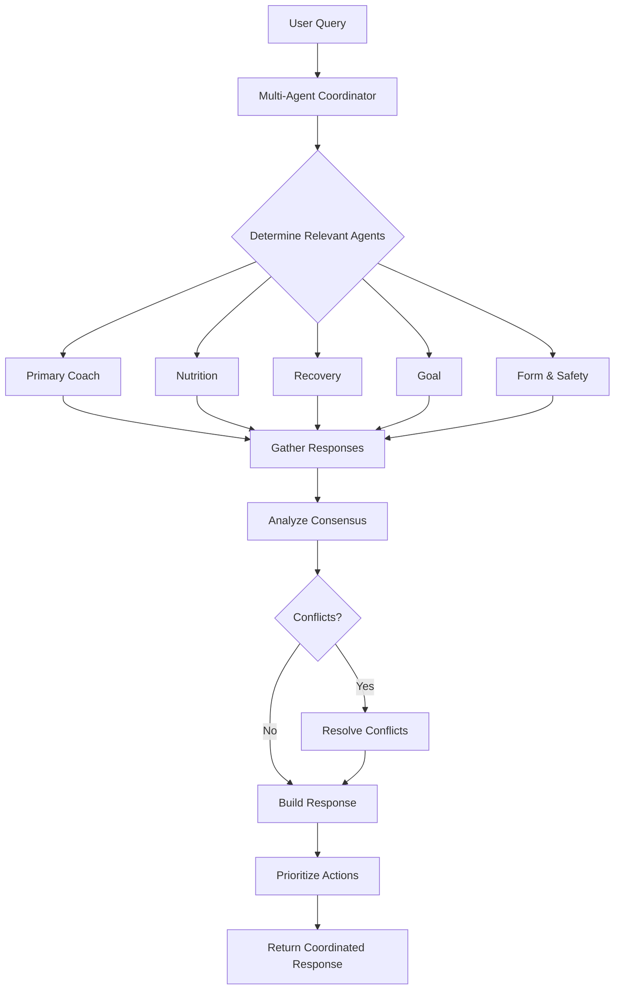

# Multi-Agent System Implementation

## Overview

The AI Fitness Coach now features a comprehensive Multi-Agent System using the OpenAI SDK. This system coordinates multiple specialized AI agents to provide holistic fitness coaching that addresses all aspects of health and fitness.

## Architecture

### Agent Hierarchy

```
Multi-Agent Coordinator
├── Primary Fitness Coach (OpenAI SDK)
├── Nutrition Specialist Agent
├── Recovery & Wellness Agent
├── Goal Achievement Agent
└── Form & Safety Agent
```

### Implemented Agents

#### 1. **Primary Fitness Coach** (`agents/openai_fitness_coach_agent.py`)
- **Role**: Overall fitness guidance and workout management
- **Personalities**: Supportive, Aggressive, Steady Pace
- **Tools**:
  - Workout scheduling and modification
  - Exercise substitution
  - Progress tracking
  - Custom workout creation

#### 2. **Nutrition Specialist** (`agents/nutrition_specialist_agent.py`)
- **Role**: Expert nutritional guidance and meal planning
- **Capabilities**:
  - Macro calculations based on goals
  - Personalized meal plans
  - Meal timing optimization
  - Supplement recommendations
  - Shopping list generation
- **Tools**:
  - `calculate_macro_needs`
  - `generate_meal_plan`
  - `analyze_meal_nutrition`
  - `suggest_meal_timing`
  - `recommend_supplements`

#### 3. **Recovery & Wellness Agent** (`agents/recovery_wellness_agent.py`)
- **Role**: Recovery optimization, sleep, and stress management
- **Capabilities**:
  - Sleep quality analysis
  - Recovery status assessment
  - Stress management protocols
  - Training load management
- **Tools**:
  - `analyze_sleep_quality`
  - `assess_recovery_status`
  - `create_recovery_protocol`
  - `optimize_sleep_routine`
  - `manage_training_stress`

#### 4. **Goal Achievement Agent** (`agents/goal_achievement_agent.py`)
- **Role**: Progress tracking and goal optimization
- **Capabilities**:
  - Goal progress analysis
  - Achievement prediction
  - Obstacle identification
  - Dynamic goal adjustment
  - Milestone planning
- **Tools**:
  - `analyze_goal_progress`
  - `predict_goal_achievement`
  - `identify_obstacles`
  - `adjust_goals`
  - `generate_motivation_strategy`

#### 5. **Form & Safety Agent** (`agents/form_safety_agent.py`)
- **Role**: Exercise form analysis and injury prevention
- **Capabilities**:
  - Form analysis and correction
  - Injury risk assessment
  - Exercise modifications
  - Movement screening
  - Safety protocols
- **Tools**:
  - `analyze_exercise_form`
  - `assess_injury_risk`
  - `suggest_exercise_modifications`
  - `develop_injury_prevention_plan`
  - `analyze_workout_safety`

### Multi-Agent Coordinator (`agents/multi_agent_coordinator.py`)

The coordinator orchestrates all agents and provides:

1. **Intelligent Agent Selection**: Automatically determines which agents to consult based on query
2. **Parallel Processing**: Agents work simultaneously for faster responses
3. **Conflict Resolution**: Resolves disagreements between agents
4. **Consensus Building**: Identifies common recommendations
5. **Priority Management**: Orders action items by importance

## API Endpoints

### Multi-Agent Chat
```http
POST /api/multi-agent/chat
{
  "message": "I want to lose weight but also build muscle",
  "context": {...},
  "required_agents": ["nutrition", "goal"],
  "personality": "supportive"
}
```

### Comprehensive Assessment
```http
POST /api/multi-agent/assessment
{
  "user_data": {
    "fitness_level": "intermediate",
    "goals": ["muscle_gain", "strength"]
  }
}
```

### Emergency Handling
```http
POST /api/multi-agent/emergency
{
  "situation": "Sharp pain in lower back during deadlifts",
  "severity": "severe"
}
```

### Weekly Summary
```http
POST /api/multi-agent/weekly-summary
```

### Agent Information
```http
GET /api/multi-agent/agents/info
```

## Usage Examples

### 1. Simple Query
```python
# User asks about nutrition
response = coordinator.process_user_query(
    "What should I eat before my morning workout?"
)
# Automatically consults Primary Coach + Nutrition Specialist
```

### 2. Complex Query Requiring Multiple Agents
```python
# User has multiple concerns
response = coordinator.process_user_query(
    "I've hit a plateau, feeling tired, and my knee hurts during squats"
)
# Consults: Primary Coach + Goal + Recovery + Form & Safety agents
```

### 3. Emergency Situation
```python
# Injury during workout
response = coordinator.handle_emergency_situation(
    situation="Sharp pain in shoulder during bench press",
    severity="severe"
)
# Prioritizes Form & Safety + Recovery agents for immediate guidance
```

## Agent Coordination Flow



## Key Features

### 1. Intelligent Query Routing
The system automatically determines which agents to consult based on:
- Keywords in the query
- Context provided
- User history
- Emergency indicators

### 2. Consensus Building
When multiple agents provide recommendations:
- Common recommendations are identified
- Confidence scores are calculated
- Conflicts are resolved using weighted consensus

### 3. Action Item Prioritization
Actions are prioritized by:
1. Safety (Form & Safety agent)
2. Recovery (Recovery agent)
3. General coaching (Primary Coach)
4. Nutrition (Nutrition agent)
5. Goals (Goal agent)

### 4. Conflict Resolution
When agents disagree:
- Weighted consensus based on confidence
- Domain expertise consideration
- Safety always takes precedence

## Testing

Run the comprehensive test suite:

```bash
python test_multi_agent_system.py
```

Tests include:
- Individual agent queries
- Multi-agent coordination
- Emergency handling
- Conflict resolution
- Stress testing
- Weekly summaries

## Performance Considerations

### Response Times
- Single agent: 3-5 seconds
- Multi-agent (3 agents): 5-7 seconds
- Full assessment (5 agents): 8-10 seconds

### Optimization Strategies
1. **Parallel Processing**: All agents work simultaneously
2. **Caching**: Agent instances are cached per user
3. **Smart Selection**: Only relevant agents are consulted
4. **Async Operations**: Full async/await implementation

## Security & Privacy

- Each agent has isolated context
- User data is not shared between users
- Emergency situations are logged for safety
- All agent interactions are traceable

## Future Enhancements

1. **Agent Learning**: Agents learn from user interactions
2. **Custom Agents**: Users can configure agent personalities
3. **Visual Analysis**: Form checking through video
4. **Real-time Monitoring**: Continuous health tracking
5. **Integration with Wearables**: Direct data from fitness devices

## Troubleshooting

### Common Issues

1. **Slow Responses**
   - Multiple agents increase response time
   - Consider limiting agents for simple queries

2. **Conflicting Recommendations**
   - Check conflict resolution logs
   - Adjust consensus threshold if needed

3. **Agent Initialization Errors**
   - Verify OpenAI API key
   - Check agent cleanup is working

## Example Responses

### Nutrition + Recovery Query
```json
{
  "primary_message": "Based on your recovery needs and muscle-building goals...",
  "agent_insights": [
    {
      "agent": "nutrition",
      "message": "For optimal muscle recovery, consume 30g protein within 30 minutes...",
      "confidence": 0.9
    },
    {
      "agent": "recovery",
      "message": "Your low HRV indicates you need additional rest...",
      "confidence": 0.85
    }
  ],
  "consensus_recommendations": [
    "Prioritize protein intake post-workout",
    "Add an extra rest day this week",
    "Focus on sleep quality"
  ],
  "action_items": [
    {"action": "Take rest day tomorrow", "priority": 1},
    {"action": "Eat protein within 30min post-workout", "priority": 2}
  ]
}
```

## API Integration

### Frontend Integration
```javascript
// React Native example
const askMultipleAgents = async (question) => {
  const response = await fetch('/api/multi-agent/chat', {
    method: 'POST',
    headers: {
      'Content-Type': 'application/json',
      'Authorization': `Bearer ${token}`
    },
    body: JSON.stringify({
      message: question,
      required_agents: ['nutrition', 'recovery']
    })
  });
  
  const data = await response.json();
  // Display coordinated response
};
```

## Monitoring & Analytics

Track multi-agent system performance:
- Query distribution across agents
- Average response times
- Conflict frequency
- User satisfaction per agent
- Emergency response effectiveness

---

The Multi-Agent System represents a significant advancement in AI fitness coaching, providing users with comprehensive, expert guidance across all aspects of their fitness journey.