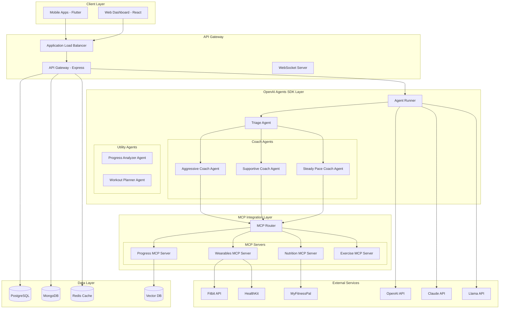

# AI Fitness Coach - Architecture Deep Dive (v2.0)

## Overview

The AI Fitness Coach application is built on a modern, scalable architecture leveraging the OpenAI Agents SDK and Model Context Protocol (MCP) to create a reliable, intelligent fitness coaching system. This updated architecture addresses all limitations of existing apps like Zing while significantly simplifying development and maintenance.

## High-Level Architecture



## Core Architecture Components

### 1. OpenAI Agents SDK Integration

The Agents SDK provides the foundation for our multi-personality coaching system, replacing traditional complex orchestration with a unified, production-ready framework.

```python
# agents/coaching_system.py
from agents import Agent, Runner, Tool
import asyncio

class AIFitnessCoachingSystem:
    def __init__(self):
        self.mcp_client = MCPClient()
        self.setup_agents()
        self.setup_guardrails()
        
    def setup_agents(self):
        """Initialize all coach personalities and utility agents"""
        
        # Aggressive Coach - High intensity, results-driven
        self.aggressive_coach = Agent(
            name="Max Power",
            instructions="""You are Max Power, an intense fitness coach who:
            - Pushes users to their absolute limits (safely)
            - Uses military-style motivation and challenges
            - Focuses on breaking personal records
            - Never accepts excuses but respects real limitations
            - Has access to real-time biometric data to ensure safety""",
            tools=[
                self.create_workout_modification_tool(),
                self.create_intensity_adjustment_tool(),
                self.mcp_client.get_tool('fitness-wearables', 'getHeartRateData'),
                self.mcp_client.get_tool('progress-tracking', 'getStrengthProgression')
            ]
        )
        
        # Supportive Coach - Encouraging and understanding
        self.supportive_coach = Agent(
            name="Emma Encourage",
            instructions="""You are Emma, a warm and supportive fitness coach who:
            - Celebrates every small victory enthusiastically
            - Provides emotional support and understanding
            - Focuses on building sustainable habits
            - Offers gentle modifications for any limitation
            - Uses positive reinforcement constantly""",
            tools=[
                self.create_workout_modification_tool(),
                self.create_habit_tracking_tool(),
                self.mcp_client.get_tool('nutrition-tracking', 'suggestHealthyMeals'),
                self.mcp_client.get_tool('progress-tracking', 'celebrateAchievements')
            ]
        )
        
        # Steady Coach - Methodical and data-driven
        self.steady_coach = Agent(
            name="Dr. Progress",
            instructions="""You are Dr. Progress, a methodical fitness coach who:
            - Bases all advice on scientific evidence
            - Explains the reasoning behind every recommendation
            - Focuses on progressive overload principles
            - Analyzes data meticulously for optimization
            - Provides detailed education on exercise physiology""",
            tools=[
                self.create_workout_modification_tool(),
                self.create_analytics_tool(),
                self.mcp_client.get_tool('progress-tracking', 'analyzeProgressData'),
                self.mcp_client.get_tool('exercise-recommendations', 'getScientificExercises')
            ]
        )
        
        # Triage Agent - Routes to appropriate coach
        self.triage_agent = Agent(
            name="Coach Selector",
            instructions="""You are responsible for routing users to the right coach:
            - If user needs motivation or is struggling: route to Emma (Supportive)
            - If user wants to push hard or break records: route to Max (Aggressive)
            - If user wants detailed explanations or data: route to Dr. Progress (Steady)
            - Consider user's current emotional state, fitness level, and goals
            - You can switch coaches mid-conversation if needed""",
            handoffs=[self.aggressive_coach, self.supportive_coach, self.steady_coach]
        )
        
    def setup_guardrails(self):
        """Configure safety guardrails for all agents"""
        
        safety_config = {
            "exercise_safety": {
                "max_heart_rate_percentage": 0.85,  # 85% of max HR
                "max_weight_increase_percent": 10,   # 10% per session
                "min_rest_between_sessions_hours": 24,
                "max_weekly_volume_increase_percent": 20
            },
            "beginner_restrictions": {
                "max_workout_duration_minutes": 45,
                "prohibited_exercises": ["snatch", "clean_and_jerk", "muscle_up"],
                "require_form_check_frequency": "every_session"
            },
            "injury_prevention": {
                "pain_reporting_threshold": 3,  # On scale of 1-10
                "auto_deload_weeks": 4,        # Deload every 4 weeks
                "movement_quality_monitoring": True
            },
            "medical_alerts": {
                "require_doctor_consultation": [
                    "chest_pain", "dizziness", "severe_joint_pain", 
                    "breathing_difficulty", "irregular_heartbeat"
                ],
                "emergency_stop_conditions": [
                    "heart_rate_above_95_percent", "reported_chest_pain"
                ]
            }
        }
        
        # Apply guardrails to all coaching agents
        for agent in [self.aggressive_coach, self.supportive_coach, self.steady_coach]:
            agent.add_guardrails(safety_config)
    
    async def handle_user_interaction(self, user_id, message, session_id=None):
        """Main entry point for all user interactions"""
        
        # Build comprehensive context with MCP data
        context = await self.build_enriched_context(user_id)
        
        # Add real-time biometric data if available
        if self.mcp_client.is_connected('fitness-wearables'):
            context['real_time_data'] = await self.mcp_client.call(
                'fitness-wearables', 
                'getCurrentBiometrics',
                {'user_id': user_id}
            )
        
        # Run through triage agent for intelligent routing
        result = await Runner.run(
            self.triage_agent,
            message,
            context=context,
            session_id=session_id or f"session_{user_id}_{int(time.time())}",
            enable_tracing=True,      # Built-in debugging
            enable_memory=True,       # Conversation memory
            timeout=30                # 30 second timeout
        )
        
        # Log interaction for analysis and improvement
        await self.log_interaction(user_id, message, result)
        
        return {
            "response": result.final_output,
            "coach_used": result.agent_path[-1].name if result.agent_path else "Triage",
            "tools_called": [tool.name for tool in result.tool_calls],
            "session_id": result.session_id,
            "trace_url": result.trace_url  # For debugging
        }
```

### 2. MCP (Model Context Protocol) Integration

MCP enables seamless access to external fitness data sources, making our AI coaches context-aware with real-time information.

```javascript
// mcp/server-config.js
class MCPIntegrationLayer {
  constructor() {
    this.initializeServers();
  }
  
  initializeServers() {
    // Wearables MCP Server - Real-time biometric data
    this.wearablesServer = new MCPServer({
      name: 'fitness-wearables',
      version: '1.0.0',
      transport: 'stdio',
      
      tools: {
        getCurrentBiometrics: {
          description: 'Get real-time heart rate, HRV, and other metrics',
          parameters: {
            user_id: { type: 'string', required: true },
            metrics: { 
              type: 'array', 
              items: ['heart_rate', 'hrv', 'spo2', 'stress'],
              default: ['heart_rate']
            }
          },
          handler: async ({ user_id, metrics }) => {
            const data = await this.aggregateBiometricData(user_id, metrics);
            return this.analyzeBiometricSafety(data);
          }
        },
        
        getRecoveryScore: {
          description: 'Calculate recovery score based on sleep and HRV',
          handler: async ({ user_id }) => {
            const [sleep, hrv, activity] = await Promise.all([
              this.getSleepData(user_id),
              this.getHRVTrends(user_id),
              this.getRecentActivity(user_id)
            ]);
            
            return this.calculateRecoveryScore(sleep, hrv, activity);
          }
        }
      }
    });
    
    // Nutrition MCP Server - Meal tracking and macro analysis
    this.nutritionServer = new MCPServer({
      name: 'nutrition-tracking',
      version: '1.0.0',
      transport: 'http',
      
      tools: {
        logMealNaturalLanguage: {
          description: 'Log a meal using natural language',
          parameters: {
            user_id: { type: 'string', required: true },
            meal_description: { type: 'string', required: true },
            meal_type: { 
              type: 'string', 
              enum: ['breakfast', 'lunch', 'dinner', 'snack'],
              required: true
            }
          },
          handler: async ({ user_id, meal_description, meal_type }) => {
            // Parse natural language to food items
            const foods = await this.nlpFoodParser.parse(meal_description);
            
            // Get detailed nutrition for each food
            const nutritionData = await Promise.all(
              foods.map(food => this.nutritionAPI.getNutrition(food))
            );
            
            // Compare against user's goals
            const userGoals = await this.getUserMacroGoals(user_id);
            const analysis = this.analyzeMacroFit(nutritionData, userGoals);
            
            // Store in database
            await this.saveMealLog(user_id, nutritionData, meal_type);
            
            return {
              foods: nutritionData,
              total_macros: this.sumMacros(nutritionData),
              goal_comparison: analysis,
              recommendations: this.generateMealRecommendations(analysis)
            };
          }
        }
      }
    });
    
    // Progress Tracking MCP Server - Workout analytics
    this.progressServer = new MCPServer({
      name: 'progress-tracking',
      version: '1.0.0',
      transport: 'websocket',
      
      tools: {
        analyzeStrengthProgression: {
          description: 'Analyze strength gains over time',
          parameters: {
            user_id: { type: 'string', required: true },
            exercise: { type: 'string' },
            time_range: { 
              type: 'string', 
              enum: ['1week', '1month', '3months', '6months'],
              default: '3months'
            }
          },
          handler: async ({ user_id, exercise, time_range }) => {
            const workoutHistory = await this.getWorkoutHistory(
              user_id, 
              time_range, 
              exercise
            );
            
            const analysis = {
              progression_rate: this.calculateProgressionRate(workoutHistory),
              volume_trends: this.analyzeVolumeTrends(workoutHistory),
              estimated_1rm: this.estimateOneRepMax(workoutHistory),
              plateau_risk: this.detectPlateauRisk(workoutHistory),
              recommendations: this.generateProgressionPlan(workoutHistory)
            };
            
            return analysis;
          }
        }
      }
    });
  }
  
  async aggregateBiometricData(userId, metrics) {
    // Aggregate data from multiple wearable sources
    const sources = [];
    
    if (await this.hasAppleHealthAccess(userId)) {
      sources.push(this.appleHealthClient.getMetrics(userId, metrics));
    }
    
    if (await this.hasFitbitAccess(userId)) {
      sources.push(this.fitbitClient.getMetrics(userId, metrics));
    }
    
    if (await this.hasGarminAccess(userId)) {
      sources.push(this.garminClient.getMetrics(userId, metrics));
    }
    
    const allData = await Promise.allSettled(sources);
    return this.mergeAndNormalizeData(allData);
  }
}
```

### 3. Enhanced Microservices Architecture

```javascript
// services/architecture.js
const microservices = {
  // User Service - Simplified with SDK handling auth
  userService: {
    responsibilities: [
      'User profile management',
      'Preferences and settings',
      'OAuth integration'
    ],
    database: 'PostgreSQL',
    apis: [
      'GET /users/:id',
      'PUT /users/:id',
      'POST /users/:id/preferences'
    ]
  },
  
  // Workout Service - Core workout management
  workoutService: {
    responsibilities: [
      'Workout plan CRUD',
      'Version control system',
      'Exercise library management',
      'Session tracking'
    ],
    database: 'PostgreSQL + MongoDB',
    apis: [
      'GET /workouts/plans',
      'POST /workouts/plans',
      'PUT /workouts/plans/:id',
      'POST /workouts/plans/:id/versions',
      'POST /workouts/sessions'
    ]
  },
  
  // Agent Orchestration Service - Manages AI interactions
  agentService: {
    responsibilities: [
      'Agent lifecycle management',
      'Context preparation',
      'Response coordination',
      'Trace analysis'
    ],
    technology: 'OpenAI Agents SDK',
    apis: [
      'POST /ai/chat',
      'GET /ai/personalities',
      'POST /ai/modify-workout',
      'GET /ai/traces/:sessionId'
    ]
  },
  
  // MCP Gateway Service - External data access
  mcpGatewayService: {
    responsibilities: [
      'MCP server management',
      'Data aggregation',
      'Cache management',
      'Rate limiting'
    ],
    technology: 'MCP Protocol',
    apis: [
      'Internal service - no external API'
    ]
  },
  
  // Analytics Service - Business intelligence
  analyticsService: {
    responsibilities: [
      'User behavior tracking',
      'Workout analytics',
      'AI interaction analysis',
      'Business metrics'
    ],
    database: 'ClickHouse + TimescaleDB',
    apis: [
      'GET /analytics/user/:id',
      'GET /analytics/workouts',
      'GET /analytics/ai-quality'
    ]
  }
};
```

### 4. Database Architecture Updates

```sql
-- Enhanced schema for agent interactions
CREATE TABLE agent_interactions (
    id UUID PRIMARY KEY DEFAULT gen_random_uuid(),
    user_id UUID REFERENCES users(id),
    session_id VARCHAR(255) NOT NULL,
    agent_name VARCHAR(100) NOT NULL,
    message_type VARCHAR(50) NOT NULL, -- 'user' or 'assistant'
    content TEXT NOT NULL,
    tools_used JSONB DEFAULT '[]',
    context_snapshot JSONB,
    trace_url TEXT,
    created_at TIMESTAMP WITH TIME ZONE DEFAULT NOW()
);

-- MCP data cache for performance
CREATE TABLE mcp_data_cache (
    id UUID PRIMARY KEY DEFAULT gen_random_uuid(),
    user_id UUID REFERENCES users(id),
    server_name VARCHAR(100) NOT NULL,
    tool_name VARCHAR(100) NOT NULL,
    parameters JSONB,
    response_data JSONB NOT NULL,
    ttl_seconds INTEGER DEFAULT 300,
    created_at TIMESTAMP WITH TIME ZONE DEFAULT NOW(),
    expires_at TIMESTAMP WITH TIME ZONE GENERATED ALWAYS AS 
        (created_at + INTERVAL '1 second' * ttl_seconds) STORED
);

-- Agent performance metrics
CREATE TABLE agent_metrics (
    id UUID PRIMARY KEY DEFAULT gen_random_uuid(),
    session_id VARCHAR(255) NOT NULL,
    agent_name VARCHAR(100) NOT NULL,
    response_time_ms INTEGER NOT NULL,
    tokens_used INTEGER,
    tools_called INTEGER DEFAULT 0,
    handoffs_count INTEGER DEFAULT 0,
    user_satisfaction_score DECIMAL(3,2),
    safety_violations INTEGER DEFAULT 0,
    created_at TIMESTAMP WITH TIME ZONE DEFAULT NOW()
);

-- Indexes for performance
CREATE INDEX idx_agent_interactions_session ON agent_interactions(session_id);
CREATE INDEX idx_agent_interactions_user_created ON agent_interactions(user_id, created_at DESC);
CREATE INDEX idx_mcp_cache_user_server ON mcp_data_cache(user_id, server_name);
CREATE INDEX idx_mcp_cache_expires ON mcp_data_cache(expires_at) WHERE expires_at > NOW();
CREATE INDEX idx_agent_metrics_session ON agent_metrics(session_id);
CREATE INDEX idx_agent_metrics_created ON agent_metrics(created_at DESC);
```

### 5. Security Architecture with SDK

```javascript
// security/enhanced-security.js
class EnhancedSecurityLayer {
  constructor() {
    this.initializeSecurityMeasures();
  }
  
  initializeSecurityMeasures() {
    // Agent-level security
    this.agentSecurity = {
      // Prevent prompt injection
      inputSanitization: {
        maxLength: 2000,
        prohibitedPatterns: [
          /ignore previous instructions/i,
          /system prompt/i,
          /admin mode/i
        ],
        sanitizer: new DOMPurify()
      },
      
      // Rate limiting per user per agent
      rateLimiting: {
        'aggressive-coach': { requests: 100, window: '15m' },
        'supportive-coach': { requests: 100, window: '15m' },
        'steady-coach': { requests: 100, window: '15m' },
        'global': { requests: 300, window: '15m' }
      },
      
      // Output validation
      outputValidation: {
        maxResponseLength: 2000,
        prohibitedContent: [
          'medical diagnosis',
          'guaranteed results',
          'medical treatment'
        ],
        requireSafetyWarnings: [
          'high intensity',
          'heavy weights',
          'advanced movements'
        ]
      }
    };
    
    // MCP security
    this.mcpSecurity = {
      // Data access controls
      accessControl: {
        'fitness-wearables': ['read:biometrics', 'read:activity'],
        'nutrition-tracking': ['read:meals', 'write:meals'],
        'progress-tracking': ['read:workouts', 'read:analytics']
      },
      
      // Data anonymization
      anonymization: {
        piiFields: ['email', 'name', 'phone', 'address'],
        healthFields: ['medical_conditions', 'medications'],
        method: 'tokenization'
      },
      
      // Audit logging
      auditLogging: {
        logLevel: 'info',
        includeFields: ['user_id', 'tool', 'timestamp', 'ip_address'],
        retention: '90 days'
      }
    };
  }
  
  async validateAgentRequest(request) {
    // Input validation
    if (!this.isValidInput(request.message)) {
      throw new SecurityError('Invalid input detected');
    }
    
    // Rate limit check
    if (await this.isRateLimited(request.userId, request.agent)) {
      throw new RateLimitError('Rate limit exceeded');
    }
    
    // Authorization check
    if (!await this.isAuthorized(request.userId, request.agent)) {
      throw new AuthorizationError('Unauthorized access');
    }
    
    return true;
  }
  
  async sanitizeAgentResponse(response) {
    // Remove any PII that shouldn't be in responses
    response = this.removePII(response);
    
    // Validate medical safety
    if (this.containsMedicalAdvice(response)) {
      response = this.addMedicalDisclaimer(response);
    }
    
    // Ensure safety warnings are included
    response = this.ensureSafetyWarnings(response);
    
    return response;
  }
}
```

### 6. Deployment Architecture

```yaml
# kubernetes/deployment.yaml
apiVersion: apps/v1
kind: Deployment
metadata:
  name: ai-fitness-coach-agent-service
spec:
  replicas: 3
  selector:
    matchLabels:
      app: agent-service
  template:
    metadata:
      labels:
        app: agent-service
    spec:
      containers:
      - name: agent-service
        image: ai-fitness-coach/agent-service:latest
        ports:
        - containerPort: 3000
        env:
        - name: OPENAI_API_KEY
          valueFrom:
            secretKeyRef:
              name: ai-credentials
              key: openai-key
        - name: ANTHROPIC_API_KEY
          valueFrom:
            secretKeyRef:
              name: ai-credentials
              key: anthropic-key
        - name: ENABLE_TRACING
          value: "true"
        resources:
          requests:
            memory: "512Mi"
            cpu: "500m"
          limits:
            memory: "1Gi"
            cpu: "1000m"
        livenessProbe:
          httpGet:
            path: /health
            port: 3000
          initialDelaySeconds: 30
          periodSeconds: 10
        readinessProbe:
          httpGet:
            path: /ready
            port: 3000
          initialDelaySeconds: 5
          periodSeconds: 5
---
apiVersion: apps/v1
kind: Deployment
metadata:
  name: mcp-gateway-service
spec:
  replicas: 2
  selector:
    matchLabels:
      app: mcp-gateway
  template:
    metadata:
      labels:
        app: mcp-gateway
    spec:
      containers:
      - name: mcp-gateway
        image: ai-fitness-coach/mcp-gateway:latest
        ports:
        - containerPort: 3001
        env:
        - name: MCP_SERVERS
          value: "wearables,nutrition,progress,exercise"
        - name: CACHE_ENABLED
          value: "true"
        resources:
          requests:
            memory: "256Mi"
            cpu: "250m"
          limits:
            memory: "512Mi"
            cpu: "500m"
```

### 7. Monitoring and Observability

```javascript
// monitoring/agent-monitoring.js
class AgentMonitoring {
  constructor() {
    this.initializeMetrics();
    this.setupTracing();
  }
  
  initializeMetrics() {
    // Agent-specific metrics
    this.metrics = {
      agentResponseTime: new Histogram({
        name: 'agent_response_time_seconds',
        help: 'Response time for agent interactions',
        labelNames: ['agent_name', 'status'],
        buckets: [0.1, 0.5, 1, 2, 5, 10]
      }),
      
      agentHandoffs: new Counter({
        name: 'agent_handoffs_total',
        help: 'Total number of agent handoffs',
        labelNames: ['from_agent', 'to_agent']
      }),
      
      mcpToolCalls: new Counter({
        name: 'mcp_tool_calls_total',
        help: 'Total MCP tool calls',
        labelNames: ['server', 'tool', 'status']
      }),
      
      safetyViolations: new Counter({
        name: 'safety_violations_total',
        help: 'Safety guardrail violations',
        labelNames: ['agent_name', 'violation_type']
      }),
      
      userSatisfaction: new Gauge({
        name: 'user_satisfaction_score',
        help: 'User satisfaction with AI responses',
        labelNames: ['agent_name']
      })
    };
  }
  
  setupTracing() {
    // OpenTelemetry configuration for agent tracing
    const tracer = opentelemetry.trace.getTracer('ai-fitness-coach', '1.0.0');
    
    this.traceAgentInteraction = async (interaction) => {
      const span = tracer.startSpan('agent.interaction', {
        attributes: {
          'user.id': interaction.userId,
          'agent.name': interaction.agentName,
          'session.id': interaction.sessionId
        }
      });
      
      try {
        // Add trace context to agent calls
        const result = await this.runWithTracing(interaction);
        
        span.setAttributes({
          'response.length': result.response.length,
          'tools.used': result.toolsUsed.join(','),
          'handoffs.count': result.handoffs.length
        });
        
        return result;
      } catch (error) {
        span.recordException(error);
        span.setStatus({ code: SpanStatusCode.ERROR });
        throw error;
      } finally {
        span.end();
      }
    };
  }
  
  async analyzeAgentPerformance(timeRange = '24h') {
    const analysis = {
      responseTimeP95: await this.getPercentile('agent_response_time', 95, timeRange),
      handoffPatterns: await this.analyzeHandoffPatterns(timeRange),
      toolUsageEfficiency: await this.analyzeToolUsage(timeRange),
      safetyCompliance: await this.analyzeSafetyCompliance(timeRange),
      userSatisfactionTrends: await this.analyzeSatisfaction(timeRange)
    };
    
    // Generate recommendations
    analysis.recommendations = this.generateOptimizationRecommendations(analysis);
    
    return analysis;
  }
}
```

## Key Architecture Benefits

### 1. Simplified Development
- **Before**: Multiple frameworks (LangChain, vector DBs, custom orchestration)
- **After**: Single OpenAI Agents SDK with built-in capabilities

### 2. Enhanced Reliability
- Built-in retry mechanisms and fallbacks
- Automatic error handling and recovery
- Production-grade from day one

### 3. Better Debugging
- Native tracing for all agent interactions
- Visual debugging tools
- Performance profiling built-in

### 4. Seamless Integration
- MCP provides standardized external data access
- No custom API integrations needed
- Real-time context enrichment

### 5. Enterprise-Ready
- Built-in security and compliance
- Scalable architecture
- Professional monitoring and alerting

## Migration Path from v1 Architecture

1. **Phase 1**: Deploy Agents SDK alongside existing system
2. **Phase 2**: Migrate coach personalities to agents
3. **Phase 3**: Implement MCP servers for external data
4. **Phase 4**: Deprecate custom orchestration code
5. **Phase 5**: Full production deployment

This architecture provides a robust, scalable foundation that directly addresses all of Zing's limitations while significantly reducing complexity and time to market.