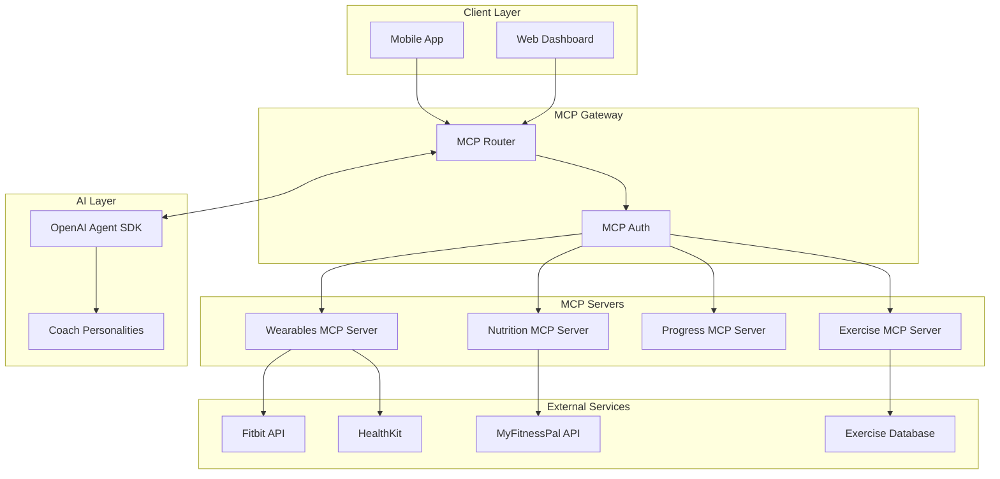

# AI Fitness Coach - MCP (Model Context Protocol) Integration

## Overview

The Model Context Protocol (MCP) is a game-changer for our AI Fitness Coach application, enabling seamless integration with wearables, nutrition databases, workout tracking systems, and exercise libraries. This document outlines how MCP transforms our architecture and addresses the core limitations of existing fitness apps like Zing.

## Why MCP is Perfect for Your Fitness App

MCP provides a standardized way for AI assistants to access external data sources and tools, making it ideal for a fitness application that needs to integrate with multiple services and databases.

### Key Integration Points

#### 1. Wearable Data Integration
**Connect to:** Fitbit, Apple Health, Garmin, Whoop, Oura Ring

**Example Use Cases:**
- "How did my heart rate during yesterday's workout compare to my usual range?"
- "Based on my sleep data, should I do a heavy workout today?"
- "What's my recovery score and how should it affect today's training?"

**Implementation:**
```javascript
// MCP Server for Wearable Integration
const wearableServer = {
  name: 'fitness-wearables',
  version: '1.0.0',
  
  tools: {
    getHeartRateData: {
      description: 'Retrieve heart rate data from connected wearables',
      parameters: {
        timeRange: { type: 'string', enum: ['yesterday', 'last_week', 'last_month'] },
        context: { type: 'string', enum: ['workout', 'rest', 'sleep'] }
      },
      handler: async ({ timeRange, context }) => {
        // Aggregate data from multiple sources
        const data = await Promise.all([
          fitbitClient.getHeartRate(timeRange),
          appleHealthClient.getHeartRate(timeRange),
          garminClient.getHeartRate(timeRange)
        ]);
        
        return aggregateHeartRateData(data, context);
      }
    },
    
    getRecoveryScore: {
      description: 'Calculate recovery score based on sleep, HRV, and activity',
      handler: async () => {
        const sleepData = await getSleepMetrics();
        const hrvData = await getHRVData();
        const activityData = await getRecentActivity();
        
        return calculateRecoveryScore(sleepData, hrvData, activityData);
      }
    }
  }
};
```

#### 2. Nutrition Database Access
**Connect to:** MyFitnessPal, Nutritionix, USDA Food Database, Open Food Facts

**Example Use Cases:**
- "Log my breakfast and tell me how it fits my macro goals"
- "Suggest a post-workout meal with 30g protein"
- "Track my daily calorie intake automatically"

**Implementation:**
```javascript
const nutritionServer = {
  name: 'nutrition-tracking',
  version: '1.0.0',
  
  tools: {
    logMeal: {
      description: 'Log a meal and analyze nutritional content',
      parameters: {
        mealDescription: { type: 'string' },
        mealType: { type: 'string', enum: ['breakfast', 'lunch', 'dinner', 'snack'] }
      },
      handler: async ({ mealDescription, mealType }) => {
        // Parse natural language meal description
        const foods = await nutritionixClient.parseNaturalLanguage(mealDescription);
        
        // Get detailed nutrition info
        const nutritionData = await Promise.all(
          foods.map(food => nutritionixClient.getNutritionInfo(food))
        );
        
        // Compare against user's macro goals
        const userGoals = await getUserMacroGoals();
        const analysis = analyzeMacroFit(nutritionData, userGoals, mealType);
        
        return {
          foods: nutritionData,
          totalMacros: calculateTotalMacros(nutritionData),
          goalComparison: analysis,
          recommendations: generateMealRecommendations(analysis)
        };
      }
    }
  }
};
```

#### 3. Progress Tracking Database
**Connect to:** Internal workout database, Strava, Strong app, FitNotes

**Example Use Cases:**
- "Show me my strength progression over the last 3 months"
- "Compare this week's volume to my 4-week average"
- "What exercises haven't I done in over 2 weeks?"

**Implementation:**
```javascript
const progressServer = {
  name: 'progress-tracking',
  version: '1.0.0',
  
  tools: {
    getStrengthProgression: {
      description: 'Analyze strength progression for specific exercises or muscle groups',
      parameters: {
        timeRange: { type: 'string' },
        exercises: { type: 'array', items: { type: 'string' } },
        metric: { type: 'string', enum: ['1rm', 'volume', 'intensity'] }
      },
      handler: async ({ timeRange, exercises, metric }) => {
        const workoutHistory = await getWorkoutHistory(timeRange);
        const progression = calculateProgression(workoutHistory, exercises, metric);
        
        return {
          progression,
          insights: generateProgressionInsights(progression),
          recommendations: suggestNextSteps(progression),
          visualizations: createProgressionCharts(progression)
        };
      }
    }
  }
};
```

#### 4. Smart Exercise Recommendations
**Connect to:** Exercise databases, biomechanics APIs, equipment availability systems

**Example Use Cases:**
- "Suggest alternative exercises for chest day since the gym is crowded"
- "Find exercises that target my weak points based on my progress data"
- "Create a workout with only the equipment in my hotel gym"

**Implementation:**
```javascript
const exerciseServer = {
  name: 'exercise-recommendations',
  version: '1.0.0',
  
  tools: {
    suggestAlternatives: {
      description: 'Suggest alternative exercises based on constraints',
      parameters: {
        targetMuscles: { type: 'array', items: { type: 'string' } },
        availableEquipment: { type: 'array', items: { type: 'string' } },
        constraints: { type: 'object' }
      },
      handler: async ({ targetMuscles, availableEquipment, constraints }) => {
        // Query exercise database
        const exercises = await exerciseDB.query({
          muscles: targetMuscles,
          equipment: availableEquipment,
          difficulty: constraints.difficulty,
          timeLimit: constraints.timeLimit
        });
        
        // Rank by user history and preferences
        const userHistory = await getUserExerciseHistory();
        const rankedExercises = rankExercisesByRelevance(
          exercises, 
          userHistory,
          constraints
        );
        
        return {
          recommendations: rankedExercises.slice(0, 10),
          reasoning: explainRecommendations(rankedExercises),
          workoutPlan: generateAdaptedWorkout(rankedExercises, constraints)
        };
      }
    }
  }
};
```

## MCP Architecture Integration

### System Architecture with MCP



### MCP Server Configuration

```javascript
// mcp-config.js
module.exports = {
  servers: [
    {
      name: 'fitness-wearables',
      transport: 'stdio',
      command: 'node',
      args: ['./mcp-servers/wearables/index.js'],
      env: {
        FITBIT_CLIENT_ID: process.env.FITBIT_CLIENT_ID,
        APPLE_HEALTH_TEAM_ID: process.env.APPLE_HEALTH_TEAM_ID,
        GARMIN_API_KEY: process.env.GARMIN_API_KEY
      }
    },
    {
      name: 'nutrition-tracking',
      transport: 'http',
      url: 'http://localhost:3001/mcp',
      headers: {
        'Authorization': `Bearer ${process.env.NUTRITION_API_KEY}`
      }
    },
    {
      name: 'progress-tracking',
      transport: 'stdio',
      command: 'python',
      args: ['./mcp-servers/progress/server.py']
    },
    {
      name: 'exercise-recommendations',
      transport: 'websocket',
      url: 'ws://localhost:3002/mcp'
    }
  ],
  
  auth: {
    type: 'oauth2',
    clientId: process.env.MCP_CLIENT_ID,
    clientSecret: process.env.MCP_CLIENT_SECRET,
    scopes: ['wearables:read', 'nutrition:write', 'progress:read', 'exercises:read']
  },
  
  rateLimit: {
    requests: 1000,
    window: '1m'
  }
};
```

## Integration with OpenAI Agent SDK

### Combined Architecture

```javascript
// Enhanced AI Coach with MCP Integration
class MCPEnabledAICoach {
  constructor() {
    this.mcpClient = new MCPClient(mcpConfig);
    this.agentSDK = new OpenAIAgentSDK();
    
    // Initialize coach personalities with MCP tools
    this.coaches = {
      aggressive: this.createAggressiveCoach(),
      supportive: this.createSupportiveCoach(),
      steady: this.createSteadyCoach()
    };
  }
  
  createAggressiveCoach() {
    return new Agent({
      name: "Aggressive Coach",
      instructions: `You're a high-energy, results-driven fitness coach. 
                     You have access to real-time biometric data, nutrition tracking, 
                     and progress analytics. Push users to their limits safely.`,
      tools: [
        this.mcpClient.getServer('fitness-wearables').tools,
        this.mcpClient.getServer('progress-tracking').tools,
        this.mcpClient.getServer('exercise-recommendations').tools
      ],
      guardrails: [
        'never_exceed_max_heart_rate',
        'respect_injury_limitations',
        'ensure_proper_recovery'
      ]
    });
  }
  
  async handleUserMessage(message, userContext) {
    // Enrich context with MCP data
    const enrichedContext = await this.enrichContextWithMCP(userContext);
    
    // Route to appropriate coach
    const coach = await this.selectCoach(message, enrichedContext);
    
    // Get response with integrated data
    const response = await this.agentSDK.run(coach, message, {
      context: enrichedContext,
      enableTracing: true
    });
    
    return response;
  }
  
  async enrichContextWithMCP(userContext) {
    const [wearableData, nutritionData, progressData] = await Promise.all([
      this.mcpClient.call('fitness-wearables', 'getRecentMetrics'),
      this.mcpClient.call('nutrition-tracking', 'getTodaysSummary'),
      this.mcpClient.call('progress-tracking', 'getWeeklyProgress')
    ]);
    
    return {
      ...userContext,
      biometrics: wearableData,
      nutrition: nutritionData,
      progress: progressData,
      timestamp: new Date().toISOString()
    };
  }
}
```

## Key Benefits of MCP Integration

### 1. **Unified Data Access**
Instead of building custom integrations for each service, MCP provides a standardized interface for accessing all fitness-related data sources.

### 2. **Real-time Context**
AI coaches can access real-time biometric data, making recommendations based on current physical state rather than static profiles.

### 3. **Seamless Tool Usage**
Coaches can directly log workouts, track nutrition, and modify plans without requiring separate API calls or complex orchestration.

### 4. **Enhanced Safety**
Real-time heart rate and recovery data enables safer workout recommendations, preventing overtraining and injury.

### 5. **Personalization at Scale**
Combining historical data with real-time metrics enables hyper-personalized coaching that adapts to daily variations.

## Implementation Timeline

### Phase 1: Core MCP Setup (Week 1)
- Set up MCP gateway and authentication
- Create basic MCP servers for each data source
- Test connectivity with external APIs

### Phase 2: Tool Development (Week 2-3)
- Implement core tools for each MCP server
- Add error handling and fallback mechanisms
- Create comprehensive tool documentation

### Phase 3: Agent Integration (Week 4)
- Integrate MCP tools with OpenAI Agent SDK
- Update coach personalities to use MCP data
- Implement context enrichment pipeline

### Phase 4: Testing & Optimization (Week 5-6)
- End-to-end testing of all integrations
- Performance optimization for real-time queries
- Security audit of MCP connections

## Security Considerations

### Data Privacy
```javascript
const securityConfig = {
  encryption: {
    transit: 'TLS 1.3',
    storage: 'AES-256-GCM',
    keys: 'AWS KMS managed'
  },
  
  authentication: {
    mcp: 'OAuth 2.0 with PKCE',
    services: 'API key rotation every 90 days',
    users: 'Multi-factor authentication required'
  },
  
  dataHandling: {
    pii: 'Tokenized before MCP transmission',
    health: 'HIPAA-compliant processing',
    retention: 'User-controlled with right to deletion'
  },
  
  audit: {
    logging: 'All MCP calls logged with user consent',
    monitoring: 'Real-time anomaly detection',
    compliance: 'Regular third-party security audits'
  }
};
```

## Monitoring and Debugging

### MCP Request Tracing
```javascript
const tracingMiddleware = async (request, next) => {
  const traceId = generateTraceId();
  
  console.log(`[MCP Trace ${traceId}] Starting request to ${request.server}:${request.tool}`);
  
  const startTime = Date.now();
  
  try {
    const result = await next(request);
    
    console.log(`[MCP Trace ${traceId}] Success in ${Date.now() - startTime}ms`);
    
    // Send to monitoring
    await metrics.record({
      traceId,
      server: request.server,
      tool: request.tool,
      duration: Date.now() - startTime,
      status: 'success'
    });
    
    return result;
  } catch (error) {
    console.error(`[MCP Trace ${traceId}] Error:`, error);
    
    await metrics.record({
      traceId,
      server: request.server,
      tool: request.tool,
      duration: Date.now() - startTime,
      status: 'error',
      error: error.message
    });
    
    throw error;
  }
};
```

## Conclusion

MCP integration transforms our AI Fitness Coach from a simple chatbot into a comprehensive fitness platform that seamlessly connects with the entire fitness ecosystem. By providing standardized access to wearables, nutrition databases, and exercise libraries, MCP enables our AI coaches to deliver truly personalized, context-aware guidance that adapts to users' real-time needs and long-term goals.

This integration directly addresses Zing's limitations by ensuring our AI coaches have access to all the data they need to make intelligent, safe, and effective workout modifications while maintaining natural, engaging conversations.