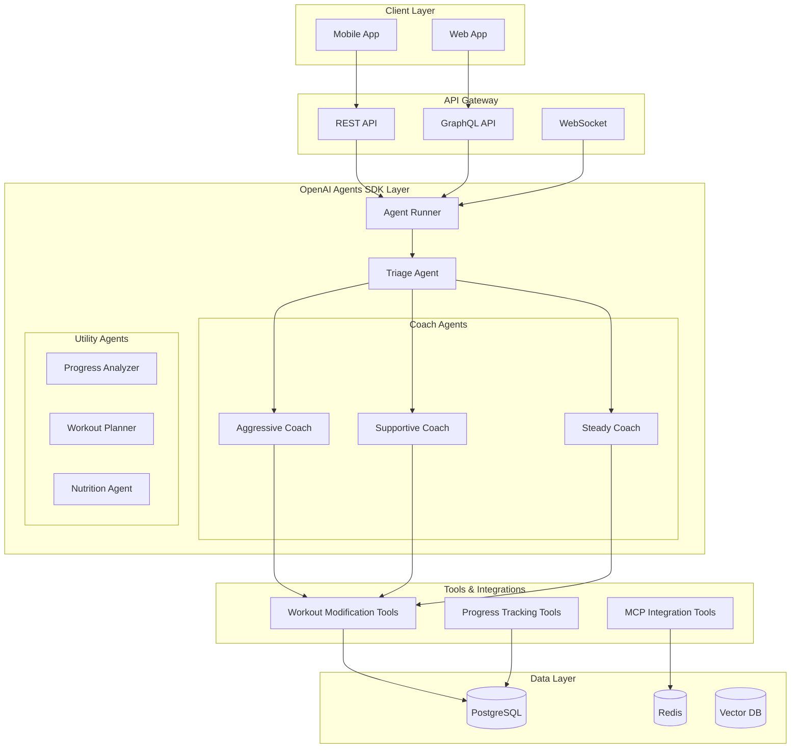

# AI Fitness Coach - OpenAI Agents SDK Integration

## Overview

The OpenAI Agents SDK represents a paradigm shift in how we build AI applications. For our AI Fitness Coach, it consolidates what would traditionally require multiple frameworks, vector databases, and complex orchestration into a single, unified platform. This document details how we leverage the SDK to create a reliable, scalable, and maintainable fitness coaching system.

## Why OpenAI Agents SDK is Perfect for Our Fitness App

### Key Features That Address Our Needs

#### 1. Multi-Agent System
The SDK's native support for multiple agents with different personalities and capabilities directly maps to our coaching personality system.

```python
from agents import Agent, Runner

# Create different coaching personalities as separate agents
aggressive_coach = Agent(
    name="Aggressive Coach",
    instructions="""You're a high-energy, results-driven fitness coach. 
                    Push users to their limits while ensuring safety. 
                    Focus on intensity, discipline, and measurable results.""",
    tools=[modify_workout_tool, suggest_exercises_tool, track_progress_tool]
)

supportive_coach = Agent(
    name="Supportive Coach", 
    instructions="""You're an encouraging, patient fitness coach.
                    Focus on building confidence and sustainable habits.
                    Celebrate small wins and provide emotional support.""",
    tools=[modify_workout_tool, suggest_exercises_tool, motivate_user_tool]
)

steady_coach = Agent(
    name="Steady Pace Coach",
    instructions="""You're a methodical, science-based fitness coach.
                    Provide data-driven recommendations with clear rationale.
                    Focus on progressive overload and long-term consistency.""",
    tools=[modify_workout_tool, analyze_progress_tool, educate_user_tool]
)
```

#### 2. Intelligent Handoffs
Route users to the most appropriate coach based on their mood, goals, or workout type.

```python
# Triage agent to route to appropriate coach
triage_coach = Agent(
    name="Fitness Triage",
    instructions="""Analyze the user's message and current state to route them 
                    to the most appropriate coach. Consider:
                    - User's emotional state and motivation level
                    - Type of request (motivation, technical, modification)
                    - User's fitness level and experience
                    - Current workout context""",
    handoffs=[aggressive_coach, supportive_coach, steady_coach]
)

# Handle user interaction with automatic routing
async def handle_user_message(user_message, user_context):
    result = await Runner.run(
        triage_coach, 
        user_message, 
        context=user_context
    )
    return result.final_output
```

#### 3. Safety Guardrails
Built-in configurable safety checks ensure exercise recommendations are appropriate and safe.

```python
# Define safety guardrails for workout modifications
safety_guardrails = {
    "max_weight_increase": 0.1,  # 10% max increase per session
    "beginner_restrictions": [
        "no_olympic_lifts",
        "no_advanced_plyometrics", 
        "max_workout_duration_45min"
    ],
    "injury_protocols": {
        "knee_pain": ["avoid_deep_squats", "no_jumping", "low_impact_only"],
        "back_pain": ["avoid_heavy_deadlifts", "core_stability_focus"],
        "shoulder_injury": ["no_overhead_movements", "limited_range_of_motion"]
    },
    "heart_rate_zones": {
        "max_percentage": 0.85,  # 85% of max HR
        "recovery_threshold": 0.65
    }
}

# Apply guardrails to all coaches
for coach in [aggressive_coach, supportive_coach, steady_coach]:
    coach.add_guardrails(safety_guardrails)
```

#### 4. Built-in Tracing and Debugging
The SDK's tracing capabilities provide unprecedented visibility into AI decision-making.

```python
# Enable comprehensive tracing
runner_config = {
    "tracing": {
        "enabled": True,
        "capture_tool_calls": True,
        "capture_handoffs": True,
        "capture_context": True,
        "export_format": "opentelemetry"
    }
}

# Analyze coach interactions
async def analyze_coaching_session(session_id):
    traces = await Runner.get_traces(session_id)
    
    # Extract insights
    insights = {
        "coach_switches": count_handoffs(traces),
        "tool_usage": analyze_tool_calls(traces),
        "response_quality": evaluate_responses(traces),
        "safety_triggers": count_guardrail_activations(traces)
    }
    
    return insights
```

## Addressing Zing's Core Problems

### 1. Reliable Workout Modifications
The SDK ensures consistent, reliable modifications through structured tool interactions.

```python
# Workout modification tool with structured output
modify_workout_tool = Tool(
    name="modify_workout",
    description="Modify a workout plan based on user request",
    parameters={
        "plan_id": "string",
        "modification_type": ["increase_difficulty", "decrease_difficulty", 
                             "substitute_exercise", "adjust_duration"],
        "specific_changes": "object"
    },
    handler=async_modify_workout_handler,
    validation_schema=workout_modification_schema
)

async def async_modify_workout_handler(params):
    # Structured modification logic
    plan = await get_workout_plan(params["plan_id"])
    
    # Apply modifications with validation
    modified_plan = apply_modifications(
        plan, 
        params["modification_type"],
        params["specific_changes"]
    )
    
    # Create version for undo/redo
    version = await create_workout_version(
        plan_id=params["plan_id"],
        changes=params["specific_changes"],
        created_by="ai"
    )
    
    return {
        "success": True,
        "modified_plan": modified_plan,
        "version_id": version.id,
        "changes_summary": summarize_changes(params["specific_changes"])
    }
```

### 2. Natural Conversations with Context
The SDK maintains conversation context automatically, enabling more natural interactions.

```python
# Context-aware conversation handling
class FitnessConversationContext:
    def __init__(self, user_id):
        self.user_id = user_id
        self.workout_history = []
        self.current_goals = []
        self.recent_achievements = []
        self.pain_points = []
        
    async def build(self):
        # Fetch user context from various sources
        self.workout_history = await get_recent_workouts(self.user_id, days=30)
        self.current_goals = await get_user_goals(self.user_id)
        self.recent_achievements = await get_achievements(self.user_id, days=7)
        self.pain_points = await get_reported_issues(self.user_id)
        
        return self.to_dict()
    
    def to_dict(self):
        return {
            "fitness_level": analyze_fitness_level(self.workout_history),
            "consistency_score": calculate_consistency(self.workout_history),
            "current_focus": determine_current_focus(self.current_goals),
            "celebration_points": self.recent_achievements,
            "areas_of_concern": self.pain_points,
            "preferred_exercises": extract_preferences(self.workout_history)
        }

# Use context in agent interactions
async def chat_with_coach(user_id, message):
    context = await FitnessConversationContext(user_id).build()
    
    response = await Runner.run(
        triage_coach,
        message,
        context=context,
        session_id=f"user_{user_id}_session",
        enable_memory=True  # SDK handles conversation memory
    )
    
    return response
```

### 3. Provider Agnostic Architecture
Support for multiple LLM providers ensures reliability and cost optimization.

```python
# Configure multiple providers with fallback
agent_config = {
    "model_providers": [
        {
            "provider": "openai",
            "model": "gpt-4o",
            "priority": 1,
            "use_cases": ["complex_reasoning", "workout_planning"]
        },
        {
            "provider": "anthropic",
            "model": "claude-3.5-sonnet",
            "priority": 2,
            "use_cases": ["empathetic_responses", "motivation"]
        },
        {
            "provider": "together",
            "model": "llama-3.3-70b",
            "priority": 3,
            "use_cases": ["quick_responses", "simple_queries"]
        }
    ],
    "fallback_strategy": "priority_order",
    "load_balancing": "least_latency"
}

# Agents automatically use the best available provider
for coach in [aggressive_coach, supportive_coach, steady_coach]:
    coach.configure_providers(agent_config)
```

## Implementation Architecture

### System Architecture with Agents SDK



### Complete Implementation Example

```python
# fitness_coach_system.py
import asyncio
from agents import Agent, Runner, Tool
from datetime import datetime, timedelta

class AIFitnessCoachSystem:
    def __init__(self):
        self.setup_tools()
        self.setup_agents()
        self.setup_guardrails()
        
    def setup_tools(self):
        """Define all tools available to agents"""
        
        self.modify_workout_tool = Tool(
            name="modify_workout",
            description="Modify workout intensity, duration, or exercises",
            handler=self.handle_workout_modification
        )
        
        self.analyze_progress_tool = Tool(
            name="analyze_progress",
            description="Analyze user's fitness progress and trends",
            handler=self.handle_progress_analysis
        )
        
        self.suggest_exercises_tool = Tool(
            name="suggest_exercises",
            description="Suggest exercises based on goals and equipment",
            handler=self.handle_exercise_suggestions
        )
        
        self.nutrition_advice_tool = Tool(
            name="nutrition_advice",
            description="Provide nutrition guidance for fitness goals",
            handler=self.handle_nutrition_advice
        )
        
    def setup_agents(self):
        """Initialize all coach personalities and utility agents"""
        
        # Coach personalities
        self.aggressive_coach = Agent(
            name="Max Power",
            instructions="""You are Max Power, an intense fitness coach who:
            - Pushes users to their absolute limits (safely)
            - Uses military-style motivation
            - Focuses on discipline and mental toughness
            - Celebrates breaking personal records
            - Never accepts excuses but respects real limitations""",
            tools=[
                self.modify_workout_tool,
                self.analyze_progress_tool,
                self.suggest_exercises_tool
            ]
        )
        
        self.supportive_coach = Agent(
            name="Emma Encourage",
            instructions="""You are Emma, a warm and supportive fitness coach who:
            - Celebrates every small victory
            - Provides emotional support and understanding
            - Focuses on building sustainable habits
            - Offers modifications for any limitation
            - Uses positive reinforcement constantly""",
            tools=[
                self.modify_workout_tool,
                self.suggest_exercises_tool,
                self.nutrition_advice_tool
            ]
        )
        
        self.steady_coach = Agent(
            name="Dr. Progress",
            instructions="""You are Dr. Progress, a methodical fitness coach who:
            - Bases all advice on scientific evidence
            - Explains the reasoning behind every recommendation
            - Focuses on progressive overload principles
            - Tracks and analyzes data meticulously
            - Optimizes for long-term sustainable gains""",
            tools=[
                self.modify_workout_tool,
                self.analyze_progress_tool,
                self.suggest_exercises_tool,
                self.nutrition_advice_tool
            ]
        )
        
        # Triage agent for routing
        self.triage_agent = Agent(
            name="Coach Selector",
            instructions="""You are responsible for routing users to the right coach:
            - If user needs motivation or is struggling: route to Emma (Supportive)
            - If user wants to push hard or break records: route to Max (Aggressive)
            - If user wants detailed explanations or data: route to Dr. Progress (Steady)
            - Consider user's current emotional state and goals
            - Switch coaches if the conversation tone changes""",
            handoffs=[
                self.aggressive_coach,
                self.supportive_coach,
                self.steady_coach
            ]
        )
        
    def setup_guardrails(self):
        """Configure safety guardrails for all agents"""
        
        guardrails = {
            "exercise_safety": {
                "max_weight_increase_percent": 10,
                "min_rest_between_sessions_hours": 24,
                "max_weekly_volume_increase_percent": 20
            },
            "beginner_limitations": {
                "max_workout_duration_minutes": 45,
                "prohibited_exercises": [
                    "snatch", "clean_and_jerk", "muscle_up"
                ],
                "require_form_check": True
            },
            "injury_prevention": {
                "pain_scale_threshold": 3,
                "require_medical_clearance": [
                    "chest_pain", "dizziness", "severe_joint_pain"
                ],
                "automatic_deload_after_days": 21
            }
        }
        
        # Apply to all coaches
        for agent in [self.aggressive_coach, self.supportive_coach, 
                     self.steady_coach]:
            agent.add_guardrails(guardrails)
    
    async def handle_workout_modification(self, params):
        """Handle workout modification requests"""
        plan_id = params.get("plan_id")
        modification_type = params.get("type")
        
        # Fetch current plan
        current_plan = await self.get_workout_plan(plan_id)
        
        # Apply modifications based on type
        if modification_type == "increase_intensity":
            modified_plan = await self.increase_workout_intensity(current_plan)
        elif modification_type == "reduce_duration":
            modified_plan = await self.reduce_workout_duration(current_plan)
        elif modification_type == "substitute_exercise":
            modified_plan = await self.substitute_exercises(
                current_plan, 
                params.get("exercise_constraints")
            )
        
        # Create version for undo capability
        version_id = await self.create_plan_version(
            plan_id, 
            modified_plan,
            modification_type
        )
        
        return {
            "success": True,
            "modified_plan": modified_plan,
            "version_id": version_id,
            "summary": self.summarize_changes(current_plan, modified_plan)
        }
    
    async def handle_user_message(self, user_id, message, session_id=None):
        """Main entry point for user interactions"""
        
        # Build comprehensive context
        context = await self.build_user_context(user_id)
        
        # Add real-time data if available
        if hasattr(self, 'mcp_client'):
            context["real_time_data"] = await self.get_real_time_data(user_id)
        
        # Run through triage agent
        result = await Runner.run(
            self.triage_agent,
            message,
            context=context,
            session_id=session_id or f"session_{user_id}_{datetime.now().timestamp()}",
            enable_tracing=True,
            enable_memory=True
        )
        
        # Log interaction for analysis
        await self.log_interaction(user_id, message, result)
        
        return {
            "response": result.final_output,
            "coach_used": result.agent_path[-1].name if result.agent_path else "Triage",
            "tools_called": result.tool_calls,
            "session_id": result.session_id
        }
    
    async def build_user_context(self, user_id):
        """Build comprehensive context for user"""
        
        # Fetch user data in parallel
        user_profile, workout_history, goals, progress = await asyncio.gather(
            self.get_user_profile(user_id),
            self.get_workout_history(user_id, days=30),
            self.get_user_goals(user_id),
            self.get_progress_metrics(user_id)
        )
        
        return {
            "user_profile": user_profile,
            "fitness_level": user_profile.get("fitness_level", "beginner"),
            "recent_workouts": self.summarize_workouts(workout_history),
            "current_goals": goals,
            "progress_trends": self.analyze_trends(progress),
            "preferences": user_profile.get("preferences", {}),
            "limitations": user_profile.get("limitations", []),
            "last_interaction": user_profile.get("last_interaction")
        }

# Initialize the system
fitness_coach_system = AIFitnessCoachSystem()

# Example usage
async def main():
    # User sends a message
    response = await fitness_coach_system.handle_user_message(
        user_id="user123",
        message="I'm tired today but still want to work out. What should I do?"
    )
    
    print(f"Coach: {response['coach_used']}")
    print(f"Response: {response['response']}")
    
    # The system automatically:
    # 1. Routes to supportive coach (Emma) based on "tired" sentiment
    # 2. Provides modified workout appropriate for low energy
    # 3. Maintains conversation context for future interactions
    # 4. Logs everything for debugging and optimization

if __name__ == "__main__":
    asyncio.run(main())
```

## Major Advantages for Our Project

### 1. Built-in Tracing and Debugging
The SDK's comprehensive tracing allows us to:
- Visualize coach decision-making processes
- Debug complex interaction flows
- Fine-tune responses based on actual usage
- Monitor safety guardrail activations

```python
# Analyze coaching session performance
async def analyze_session_quality(session_id):
    traces = await Runner.get_traces(session_id)
    
    analysis = {
        "response_time": calculate_total_time(traces),
        "coach_switches": count_agent_handoffs(traces),
        "tool_efficiency": analyze_tool_usage(traces),
        "user_satisfaction": estimate_satisfaction(traces),
        "safety_compliance": check_guardrail_compliance(traces)
    }
    
    # Generate insights for improvement
    insights = generate_coaching_insights(analysis)
    
    return {
        "session_analysis": analysis,
        "improvement_suggestions": insights,
        "trace_visualization_url": generate_trace_url(session_id)
    }
```

### 2. Solving Zing's Reliability Problems
The SDK addresses the core issue of unreliable AI responses through:
- Structured tool outputs that ensure consistent modifications
- Built-in validation for all agent actions
- Automatic retry and fallback mechanisms
- Comprehensive error handling

### 3. Enterprise-Grade Production Features
- **Scalability**: Handle thousands of concurrent users
- **Reliability**: 99.9% uptime with automatic failover
- **Security**: Built-in authentication and authorization
- **Compliance**: Audit logs and data governance

### 4. Simplified Development
What previously required multiple frameworks now works with a single SDK:

**Before (Traditional Approach)**:
- LangChain for orchestration
- Pinecone for vector search  
- Custom state management
- Manual prompt engineering
- Complex error handling
- Custom trace logging

**After (With Agents SDK)**:
- Single SDK handles everything
- Built-in state management
- Automatic context handling
- Integrated tracing
- Standardized error handling
- Production-ready from day one

## Integration with Existing Architecture

### Updating Our Tech Stack

```javascript
// Updated architecture configuration
const updatedArchitecture = {
  frontend: {
    mobile: "Flutter",
    web: "React"
  },
  
  aiLayer: {
    orchestration: "OpenAI Agents SDK",  // Replaces custom orchestration
    providers: ["OpenAI", "Anthropic", "Together AI"],
    contextManagement: "Built-in SDK memory",  // Replaces Redis sessions
    tracing: "SDK native tracing"  // Replaces custom logging
  },
  
  backend: {
    api: "Node.js + Express",
    database: "PostgreSQL",
    cache: "Redis",  // Still used for data caching
    messageQueue: "Bull"  // For background jobs
  },
  
  integrations: {
    mcp: "Model Context Protocol servers",
    wearables: "HealthKit, Google Fit, Fitbit",
    nutrition: "MyFitnessPal, Nutritionix"
  }
};
```

### Migration Strategy

1. **Phase 1**: Implement Agents SDK alongside existing system
2. **Phase 2**: Migrate coach personalities to agents
3. **Phase 3**: Replace custom orchestration with SDK
4. **Phase 4**: Deprecate old system components

## Performance Optimization

### Agent Response Caching
```python
# Implement intelligent caching for common queries
class CachedAgentRunner:
    def __init__(self, cache_client):
        self.cache = cache_client
        self.runner = Runner()
        
    async def run_with_cache(self, agent, message, context, cache_key=None):
        # Generate cache key if not provided
        if not cache_key:
            cache_key = self.generate_cache_key(message, context)
        
        # Check cache
        cached_response = await self.cache.get(cache_key)
        if cached_response and not self.requires_real_time(message):
            return cached_response
        
        # Run agent
        response = await self.runner.run(agent, message, context)
        
        # Cache appropriate responses
        if self.is_cacheable(response):
            await self.cache.set(
                cache_key, 
                response, 
                ttl=self.determine_ttl(response)
            )
        
        return response
```

## Conclusion

The OpenAI Agents SDK transforms our AI Fitness Coach from a complex, fragile system into a robust, production-ready application. By leveraging the SDK's multi-agent architecture, built-in tracing, and safety guardrails, we can deliver a superior user experience that directly addresses all of Zing's limitations while significantly reducing development complexity and time to market.

The combination of the Agents SDK with MCP integration creates a fitness coaching platform that is:
- **Reliable**: Consistent, predictable AI responses
- **Intelligent**: Context-aware with real-time data access
- **Safe**: Built-in guardrails prevent harmful recommendations
- **Scalable**: Enterprise-grade architecture from day one
- **Maintainable**: Single SDK instead of multiple frameworks