# AI Fitness Coach - Feature Validation Framework

## Overview

This comprehensive validation framework ensures that every feature meets quality standards, user expectations, and business objectives before release. It provides specific acceptance criteria, testing protocols, and success metrics for each feature.

## Validation Process

```mermaid
graph LR
    A[Feature Concept] --> B[Acceptance Criteria]
    B --> C[Development]
    C --> D[Unit Testing]
    D --> E[Integration Testing]
    E --> F[User Acceptance Testing]
    F --> G[Beta Testing]
    G --> H[Performance Validation]
    H --> I[Security Review]
    I --> J[Production Release]
    J --> K[Post-Release Monitoring]
```



## Core Feature Validations

### 1. User Authentication & Authorization

#### Acceptance Criteria
- [ ] Users can sign in with Google OAuth in < 3 seconds
- [ ] Apple Sign In works on iOS devices
- [ ] Token refresh happens automatically without user intervention
- [ ] Logout clears all user data from device
- [ ] Account deletion removes all user data within 30 days

#### Test Scenarios
```javascript
// Test: Google OAuth Flow
describe('Google Authentication', () => {
  it('should complete OAuth flow successfully', async () => {
    const result = await authService.signInWithGoogle();
    expect(result).toHaveProperty('user');
    expect(result).toHaveProperty('accessToken');
    expect(result.user.email).toMatch(/@gmail.com$/);
  });

  it('should handle cancelled authentication', async () => {
    mockGoogleSignIn.mockRejectedValue({ code: 'CANCELLED' });
    const result = await authService.signInWithGoogle();
    expect(result).toBeNull();
  });

  it('should persist authentication across app restarts', async () => {
    await authService.signInWithGoogle();
    await app.restart();
    const user = await authService.getCurrentUser();
    expect(user).not.toBeNull();
  });
});
```

#### Performance Benchmarks
- Authentication time: < 3 seconds (95th percentile)
- Token refresh time: < 500ms
- Session validation: < 100ms

#### Security Requirements
- [ ] OAuth tokens stored in secure storage
- [ ] No passwords stored on device
- [ ] Biometric authentication option available
- [ ] Session timeout after 30 days of inactivity

### 2. AI Coaching System

#### Acceptance Criteria
- [ ] AI responds to user messages within 2 seconds
- [ ] Responses are contextually appropriate to user's fitness level
- [ ] AI can modify workouts based on user requests
- [ ] Safety warnings triggered for dangerous requests
- [ ] Personality consistency maintained throughout conversation

#### Validation Tests
```python
# AI Response Quality Tests
class AICoachingValidation:
    def test_response_time(self):
        start_time = time.time()
        response = ai_service.generate_response(
            "Add more leg exercises to my workout",
            user_context=test_user_context
        )
        response_time = time.time() - start_time
        assert response_time < 2.0, f"Response took {response_time}s"

    def test_contextual_awareness(self):
        # Test 1: Beginner user
        beginner_context = UserContext(fitness_level="beginner")
        response = ai_service.generate_response(
            "I want to do heavy deadlifts",
            user_context=beginner_context
        )
        assert "form" in response.message.lower()
        assert "start light" in response.message.lower()

        # Test 2: User with injury
        injury_context = UserContext(injuries=["lower back pain"])
        response = ai_service.generate_response(
            "Add deadlifts to my routine",
            user_context=injury_context
        )
        assert response.safety_warnings != []
        assert "alternative" in response.message.lower()

    def test_workout_modification_accuracy(self):
        modifications = [
            ("Add 3 sets of squats", ["squats", "3", "sets"]),
            ("Remove all cardio", ["remove", "cardio"]),
            ("Replace bench press with push-ups", ["replace", "bench press", "push-ups"])
        ]
        
        for request, expected_keywords in modifications:
            response = ai_service.generate_response(request)
            assert response.workout_modifications is not None
            for keyword in expected_keywords:
                assert keyword in str(response.workout_modifications).lower()
```

#### Personality Validation
```javascript
// Personality Consistency Test
const personalityTests = {
  aggressive: {
    keywords: ['push', 'harder', 'no excuses', 'maximum', 'beast mode'],
    tone: 'assertive',
    motivation_style: 'challenging'
  },
  supportive: {
    keywords: ['great job', 'proud', 'you can do', 'believe', 'amazing'],
    tone: 'encouraging',
    motivation_style: 'positive'
  },
  steady: {
    keywords: ['consistent', 'progress', 'sustainable', 'long-term', 'patience'],
    tone: 'measured',
    motivation_style: 'educational'
  }
};

async function validatePersonality(personality) {
  const responses = [];
  const testPrompts = [
    "I'm too tired to workout",
    "I completed all my sets!",
    "Should I increase the weight?"
  ];

  for (const prompt of testPrompts) {
    const response = await aiService.chat(prompt, personality);
    responses.push(response);
  }

  // Analyze responses for personality consistency
  const analysis = analyzePersonalityConsistency(responses, personalityTests[personality]);
  expect(analysis.consistency_score).toBeGreaterThan(0.8);
}
```

#### Success Metrics
- Response accuracy: > 90%
- User satisfaction rating: > 4.5/5
- Safety protocol adherence: 100%
- Personality consistency: > 85%

### 3. Workout Version Control

#### Acceptance Criteria
- [ ] Every workout modification creates a new version
- [ ] Users can view complete version history
- [ ] Undo operation reverts to previous version in < 1 second
- [ ] Version comparison shows clear differences
- [ ] Maximum 50 versions stored per workout

#### Functional Tests
```javascript
// Version Control Tests
describe('Workout Version Control', () => {
  let workout;
  
  beforeEach(() => {
    workout = createTestWorkout();
  });

  test('creates new version on modification', async () => {
    const originalVersion = workout.version;
    
    await workoutService.addExercise(workout.id, {
      name: 'Squats',
      sets: 3,
      reps: 10
    });

    const updatedWorkout = await workoutService.getWorkout(workout.id);
    expect(updatedWorkout.version).toBe(originalVersion + 1);
  });

  test('undo reverts to previous version', async () => {
    // Make multiple changes
    const v1 = await workoutService.getWorkout(workout.id);
    await workoutService.addExercise(workout.id, exercise1);
    
    const v2 = await workoutService.getWorkout(workout.id);
    await workoutService.addExercise(workout.id, exercise2);
    
    // Undo last change
    await workoutService.undo(workout.id);
    const reverted = await workoutService.getWorkout(workout.id);
    
    expect(reverted.exercises).toEqual(v2.exercises);
    expect(reverted.version).toBe(3); // New version created for undo
  });

  test('version diff shows accurate changes', async () => {
    const v1 = await workoutService.getVersion(workout.id, 1);
    const v2 = await workoutService.getVersion(workout.id, 2);
    
    const diff = await workoutService.compareVersions(v1, v2);
    
    expect(diff).toEqual({
      added: [expect.objectContaining({ name: 'Squats' })],
      removed: [],
      modified: []
    });
  });

  test('version history pagination', async () => {
    // Create 25 versions
    for (let i = 0; i < 25; i++) {
      await workoutService.addExercise(workout.id, { name: `Exercise ${i}` });
    }

    const page1 = await workoutService.getVersionHistory(workout.id, { page: 1, limit: 10 });
    expect(page1.versions.length).toBe(10);
    expect(page1.totalVersions).toBe(26); // Original + 25 modifications
    expect(page1.hasMore).toBe(true);
  });
});
```

#### Performance Requirements
- Version creation: < 500ms
- Version retrieval: < 200ms
- Undo operation: < 1000ms
- Diff calculation: < 300ms

### 4. Exercise Recommendation Engine

#### Acceptance Criteria
- [ ] Recommendations consider user's fitness level
- [ ] Muscle group balance maintained
- [ ] Equipment constraints respected
- [ ] Injury considerations applied
- [ ] Progressive overload principles followed

#### Validation Tests
```python
# Recommendation Engine Tests
class RecommendationValidation:
    def test_muscle_group_balance(self):
        user_history = [
            Exercise(name="Bench Press", muscle_groups=["chest", "triceps"]),
            Exercise(name="Shoulder Press", muscle_groups=["shoulders"]),
            Exercise(name="Bicep Curls", muscle_groups=["biceps"])
        ]
        
        recommendations = recommendation_engine.get_recommendations(
            user_id="test_user",
            recent_exercises=user_history,
            count=5
        )
        
        # Should recommend back and leg exercises for balance
        recommended_muscle_groups = set()
        for exercise in recommendations:
            recommended_muscle_groups.update(exercise.muscle_groups)
        
        assert "back" in recommended_muscle_groups
        assert any(mg in recommended_muscle_groups for mg in ["quadriceps", "hamstrings", "glutes"])

    def test_equipment_filtering(self):
        user_equipment = ["dumbbells", "resistance_bands"]
        
        recommendations = recommendation_engine.get_recommendations(
            user_id="test_user",
            available_equipment=user_equipment,
            count=10
        )
        
        for exercise in recommendations:
            required_equipment = exercise.equipment_required
            assert all(eq in user_equipment + ["none"] for eq in required_equipment)

    def test_progressive_overload(self):
        # User has been doing 3x10 squats at 100lbs
        user_history = [
            WorkoutSession(
                exercise="Squats",
                sets=3,
                reps=10,
                weight=100,
                date=datetime.now() - timedelta(days=7)
            ),
            WorkoutSession(
                exercise="Squats",
                sets=3,
                reps=10,
                weight=100,
                date=datetime.now() - timedelta(days=3)
            )
        ]
        
        recommendation = recommendation_engine.get_progression_recommendation(
            exercise="Squats",
            history=user_history
        )
        
        # Should recommend slight increase
        assert recommendation.weight >= 102.5  # 2.5-5% increase
        assert recommendation.weight <= 110    # Not more than 10% increase
```

#### Success Metrics
- Recommendation acceptance rate: > 60%
- Exercise variety score: > 0.8
- User reported satisfaction: > 4/5
- Injury prevention rate: 0 injuries from recommendations

### 5. Progress Tracking & Analytics

#### Acceptance Criteria
- [ ] Visual charts load in < 1 second
- [ ] Data accuracy 100% (no calculation errors)
- [ ] Multiple time ranges available (week, month, year)
- [ ] Export functionality works on all platforms
- [ ] Predictive analytics within 10% accuracy

#### Validation Tests
```dart
// Progress Analytics Tests
class ProgressAnalyticsTests {
  test('calculates strength progression correctly', () async {
    final sessions = [
      WorkoutSession(
        exercise: 'Bench Press',
        weight: 135,
        reps: 10,
        date: DateTime.now().subtract(Duration(days: 30)),
      ),
      WorkoutSession(
        exercise: 'Bench Press',
        weight: 145,
        reps: 10,
        date: DateTime.now().subtract(Duration(days: 15)),
      ),
      WorkoutSession(
        exercise: 'Bench Press',
        weight: 155,
        reps: 10,
        date: DateTime.now(),
      ),
    ];

    final progression = ProgressCalculator.calculateStrengthProgression(sessions);
    
    expect(progression.percentageIncrease, equals(14.8)); // (155-135)/135 * 100
    expect(progression.averageWeeklyIncrease, closeTo(5.0, 0.1)); // 20lbs over 4 weeks
  });

  test('predicts goal achievement date', () async {
    final userGoal = WeightLossGoal(
      startWeight: 200,
      targetWeight: 180,
      startDate: DateTime.now().subtract(Duration(days: 30)),
    );

    final recentProgress = [
      ProgressEntry(weight: 200, date: DateTime.now().subtract(Duration(days: 30))),
      ProgressEntry(weight: 197, date: DateTime.now().subtract(Duration(days: 20))),
      ProgressEntry(weight: 195, date: DateTime.now().subtract(Duration(days: 10))),
      ProgressEntry(weight: 194, date: DateTime.now()),
    ];

    final prediction = ProgressPredictor.predictGoalDate(userGoal, recentProgress);
    
    // Lost 6 lbs in 30 days = 0.2 lbs/day
    // Need to lose 14 more lbs = 70 days
    expect(prediction.estimatedDays, closeTo(70, 10));
    expect(prediction.confidence, greaterThan(0.7));
  });
}
```

#### Performance Benchmarks
- Chart rendering: < 1000ms for 365 data points
- Calculation accuracy: 100%
- Data export: < 5 seconds for 1 year of data
- Real-time updates: < 100ms

### 6. Offline Mode

#### Acceptance Criteria
- [ ] Core features work without internet
- [ ] Data syncs when connection restored
- [ ] No data loss during offline period
- [ ] Conflict resolution handles all edge cases
- [ ] User notified of offline status

#### Validation Scenarios
```javascript
// Offline Mode Tests
describe('Offline Functionality', () => {
  test('creates workouts offline', async () => {
    await networkHelper.goOffline();
    
    const workout = await workoutService.createWorkout({
      name: 'Offline Workout',
      exercises: [...]
    });
    
    expect(workout.id).toBeDefined();
    expect(workout.syncStatus).toBe('pending');
    
    // Verify stored locally
    const localWorkout = await localDatabase.getWorkout(workout.id);
    expect(localWorkout).toBeDefined();
  });

  test('syncs when back online', async () => {
    // Create data offline
    await networkHelper.goOffline();
    const workouts = await createMultipleWorkouts(5);
    
    // Go back online
    await networkHelper.goOnline();
    
    // Wait for sync
    await waitForSync();
    
    // Verify all workouts synced
    for (const workout of workouts) {
      const serverWorkout = await apiService.getWorkout(workout.id);
      expect(serverWorkout).toBeDefined();
      expect(serverWorkout.name).toBe(workout.name);
    }
  });

  test('resolves conflicts correctly', async () => {
    const workout = await createWorkout();
    
    // Modify offline
    await networkHelper.goOffline();
    await workoutService.updateWorkout(workout.id, { name: 'Offline Name' });
    
    // Simulate server modification
    await serverHelper.updateWorkout(workout.id, { name: 'Server Name' });
    
    // Go back online
    await networkHelper.goOnline();
    await waitForSync();
    
    // Verify conflict resolution (latest wins)
    const resolved = await workoutService.getWorkout(workout.id);
    expect(resolved.name).toBe('Offline Name'); // Client wins for user-initiated changes
  });
});
```

### 7. Social Features

#### Acceptance Criteria
- [ ] Friend requests send/receive properly
- [ ] Privacy settings respected
- [ ] Workout sharing includes all relevant data
- [ ] Challenges track progress accurately
- [ ] Notifications work across platforms

#### Privacy Validation
```javascript
// Privacy Tests
test('respects privacy settings', async () => {
  const user1 = await createUser({ privacy: 'friends-only' });
  const user2 = await createUser();
  const user3 = await createUser();
  
  // User2 is friend, User3 is not
  await socialService.addFriend(user1.id, user2.id);
  
  // User2 can see workouts
  const workoutsForFriend = await socialService.getUserWorkouts(user1.id, user2.id);
  expect(workoutsForFriend.length).toBeGreaterThan(0);
  
  // User3 cannot see workouts
  const workoutsForStranger = await socialService.getUserWorkouts(user1.id, user3.id);
  expect(workoutsForStranger).toEqual([]);
});
```

## Beta Testing Protocol

### Beta Test Groups
1. **Internal Alpha** (Team + Family): 10 users, 1 week
2. **Closed Beta** (Fitness enthusiasts): 100 users, 2 weeks
3. **Open Beta** (General public): 1000 users, 4 weeks

### Beta Feedback Collection
```javascript
// Beta Feedback Schema
const betaFeedback = {
  user_id: String,
  app_version: String,
  feature_ratings: {
    ai_coaching: Number, // 1-5
    workout_tracking: Number,
    recommendations: Number,
    ui_design: Number,
    performance: Number
  },
  bugs_found: [{
    description: String,
    severity: String, // 'critical', 'major', 'minor'
    steps_to_reproduce: [String],
    screenshot_url: String
  }],
  feature_requests: [{
    title: String,
    description: String,
    priority: Number // 1-10
  }],
  would_recommend: Boolean,
  overall_rating: Number, // 1-10
  comments: String
};
```

### Beta Success Criteria
- [ ] Crash rate < 0.1%
- [ ] Average session length > 15 minutes
- [ ] Daily active users > 60%
- [ ] Feature completion rate > 80%
- [ ] NPS score > 50

## Performance Validation

### Load Testing Scenarios
```yaml
# k6 Load Test Configuration
scenarios:
  standard_load:
    executor: 'ramping-vus'
    startVUs: 0
    stages:
      - duration: '2m', target: 100  # Ramp up
      - duration: '5m', target: 100  # Stay at 100 users
      - duration: '2m', target: 0    # Ramp down
    
  spike_test:
    executor: 'ramping-vus'
    startVUs: 0
    stages:
      - duration: '30s', target: 500  # Spike to 500 users
      - duration: '1m', target: 500   # Hold
      - duration: '30s', target: 0    # Drop

  endurance_test:
    executor: 'constant-vus'
    vus: 50
    duration: '2h'  # Run for 2 hours

thresholds:
  http_req_duration: ['p(95)<500', 'p(99)<1000']  # 95% under 500ms
  http_req_failed: ['rate<0.01']                   # Error rate under 1%
  iterations: ['rate>1']                            # At least 1 req/s per VU
```

### Mobile Performance Criteria
- App launch time: < 3 seconds
- Screen transition: < 300ms
- List scrolling: 60 FPS
- Memory usage: < 150MB
- Battery drain: < 5% per hour of active use

## Security Validation

### Security Checklist
- [ ] All API endpoints require authentication
- [ ] SQL injection prevention tested
- [ ] XSS protection validated
- [ ] Data encryption verified (at rest and in transit)
- [ ] OAuth implementation follows best practices
- [ ] No sensitive data in logs
- [ ] Rate limiting effective
- [ ] Input validation comprehensive

### Penetration Testing
```bash
# OWASP ZAP Security Scan
docker run -t owasp/zap2docker-stable zap-baseline.py \
  -t https://api.fitnessapp.com \
  -r security_report.html

# Mobile App Security
mobsf --scan fitness_app.apk
mobsf --scan fitness_app.ipa
```

## Accessibility Validation

### WCAG 2.1 Compliance
- [ ] All images have alt text
- [ ] Color contrast ratio ≥ 4.5:1
- [ ] Touch targets ≥ 44x44 points
- [ ] Screen reader compatible
- [ ] Keyboard navigation supported
- [ ] Focus indicators visible

### Accessibility Tests
```dart
// Flutter Accessibility Tests
testWidgets('meets accessibility standards', (WidgetTester tester) async {
  await tester.pumpWidget(MyApp());

  // Check semantic labels
  expect(find.bySemanticsLabel('Start Workout'), findsOneWidget);
  
  // Verify touch target sizes
  final buttonFinder = find.byType(ElevatedButton);
  final button = tester.widget<ElevatedButton>(buttonFinder);
  final renderBox = tester.renderObject<RenderBox>(buttonFinder);
  
  expect(renderBox.size.width, greaterThanOrEqualTo(44));
  expect(renderBox.size.height, greaterThanOrEqualTo(44));
  
  // Test with large text
  await tester.pumpWidget(
    MediaQuery(
      data: MediaQueryData(textScaleFactor: 2.0),
      child: MyApp(),
    ),
  );
  
  // Ensure no overflow
  expect(tester.takeException(), isNull);
});
```

## Post-Release Monitoring

### Key Metrics to Track
```javascript
// Analytics Events
const postReleaseMetrics = {
  user_engagement: {
    daily_active_users: 'COUNT(DISTINCT user_id) per day',
    session_duration: 'AVG(session_end - session_start)',
    feature_adoption: 'COUNT(feature_used) / COUNT(total_users)',
    retention_rate: 'users_active_day_N / users_active_day_0'
  },
  
  performance: {
    crash_rate: 'crashes / sessions',
    api_response_time: 'p50, p95, p99 response times',
    app_launch_time: 'time_to_interactive',
    error_rate: 'errors / total_requests'
  },
  
  business: {
    conversion_rate: 'paid_users / total_users',
    churn_rate: 'cancelled_users / total_paid_users',
    revenue_per_user: 'total_revenue / active_users',
    feature_roi: 'feature_value / development_cost'
  }
};
```

### Rollback Criteria
- Crash rate > 1%
- API error rate > 5%
- User complaints > 10% of active users
- Critical security vulnerability discovered
- Data corruption detected

## Validation Sign-off Template

```markdown
## Feature: [Feature Name]
## Version: [X.X.X]
## Release Date: [YYYY-MM-DD]

### Validation Checklist
- [ ] All acceptance criteria met
- [ ] Unit tests passing (coverage > 80%)
- [ ] Integration tests passing
- [ ] Performance benchmarks met
- [ ] Security review completed
- [ ] Accessibility standards met
- [ ] Beta testing feedback addressed
- [ ] Documentation updated
- [ ] Rollback plan in place

### Sign-offs
- Development Lead: _____________ Date: _______
- QA Lead: _____________________ Date: _______
- Product Manager: ______________ Date: _______
- Security Team: _______________ Date: _______

### Notes
[Any additional notes or exceptions]
```

This comprehensive validation framework ensures that every feature of the AI Fitness Coach app meets the highest standards of quality, performance, and user satisfaction before release.